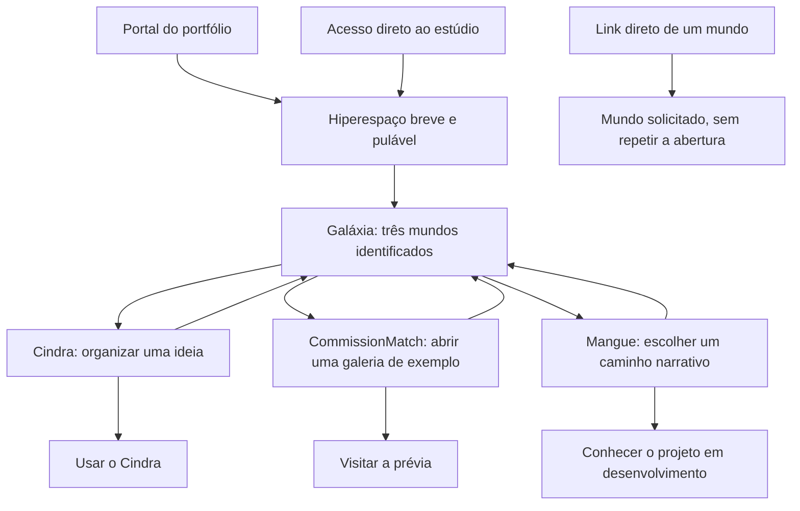

# Jornada — chegada, mapa e mundos

Roteiro proposto v0.2 · 6 de setembro de 2026. Complementa o [briefing](brief.md). O acabamento é predominantemente ilustrado, com profundidade em camadas. Efeitos pontuais e ambientes suaves foram confirmados pelo usuário; a pauta detalhada está no [plano sonoro](audio.md). Durações são parâmetros de estudo, não medições ou tempos mínimos obrigatórios.

## Estrutura da visita

A rota sugerida é Cindra → CommissionMatch → Mangue. Ela existe como convite e indicação do próximo destino. O visitante pode ignorá-la, inverter a ordem, sair para um produto ou retornar ao mapa a qualquer momento.

## Cena 01 — trânsito pelo hiperespaço

**Função:** marcar a passagem para o universo do estúdio enquanto a primeira composição fica disponível.

**Imagem:** estrelas se alongam em profundidade; pequenas faixas rosa, azul e verde atravessam a periferia. Morfeu aparece brevemente na cabine ou pela silhueta da nave, orientado para a chegada. A nave desacelera, os riscos encurtam e o mapa emerge no mesmo eixo de câmera.

**Ritmo proposto:** aproximadamente 1,2–2 s quando houver carregamento correspondente. Se a cena estiver pronta antes, encurtar a viagem. Não impor um atraso mínimo para terminar o espetáculo. Quem chegou pelo portal já assistiu a uma partida; essa origem deve receber uma chegada mais curta quando houver informação confiável da origem.

**Controle visível:** “Pular viagem”. Não apresentar porcentagem simulada. Durante carga lenta, uma frase de estado verdadeira pode acompanhar um mapa estático disponível. Os destinos textuais aparecem independentemente dos efeitos pesados.

**Saídas:** pular, concluir chegada, falha de asset, movimento reduzido ou acesso direto a mundo. Na revisita da sessão, abrir no mapa ou destino solicitado; oferecer repetir a abertura apenas como gesto secundário.

**Som:** impulso e desaceleração acompanham a viagem somente se o visitante tiver ativado o áudio. O controle “Ativar som” não bloqueia a chegada; caso seja acionado depois, começar pelo ambiente do estado atual, sem reproduzir efeitos que já passaram.

## Cena 02 — reconhecer a galáxia

**Função:** permitir a escolha e estabelecer a personalidade do estúdio.

**Enquadramento desktop proposto:** uma grande janela espacial. A assinatura do estúdio e duas linhas de apresentação ocupam uma área escura. Os mundos se distribuem assimetricamente em profundidade; uma nave próxima dá escala. Cada nome permanece junto do seu planeta em um ponto estável de leitura.

**Rótulos iniciais propostos:**

| Nome | Explicação curta | Estágio |
|---|---|---|
| Cindra | Para organizar a vida | Disponível |
| CommissionMatch | Para descobrir artistas | Em prévia |
| Mangue | Para criar histórias com escolhas | Em desenvolvimento |

O estágio é texto, acompanhado opcionalmente de um pequeno sinal. Não depender somente de cor. Em telas pequenas, o rótulo explicativo pode aparecer na seleção, enquanto nomes e estágios continuam acessíveis.

**Morfeu:** ao entrar, faz um arco curto, desacelera e olha para Cindra. A indicação “Viajar com Morfeu” evidencia a rota sugerida. Ao longo da exploração, aguarda a decisão; não repete balões a cada poucos segundos.

**Som:** ambiente discreto de cabine no mapa; somente o mundo aberto recebe seu ambiente próprio. Planetas não disputam presença sonora enquanto a pessoa escolhe. Hover isolado permanece silencioso.

**Hover/foco:** a atmosfera do planeta responde, o rótulo ganha ênfase e a nave se orienta suavemente. O planeta e sua área clicável permanecem estáveis; ele não foge do cursor nem muda de lugar quando a pessoa tenta clicar.

**Clique/toque/Enter:** um único acionamento abre o mundo. Não exigir primeiro revelar tooltip e depois descobrir outro botão escondido. Prévia em hover é informação adicional, não etapa obrigatória.

## Cena 03 — aproximação

**Função:** conectar o ponto no mapa ao cenário detalhado, preservando orientação.

**Sequência proposta:** feedback imediato na seleção; Morfeu inclina a nave; a câmera aproxima o destino; elementos de primeiro plano revelam a superfície; a interface de demonstração se estabiliza.

**Ritmo:** gesto de reconhecimento em 120–200 ms; deslocamento total de aproximadamente 700–1.100 ms. Não somar vários efeitos longos em cadeia. Os tempos finais dependem da leitura visual e do aparelho.

**Controle:** “Voltar à galáxia” permanece disponível. Uma nova escolha cancela a transição anterior e resolve o último destino pedido. Nenhuma navegação fica presa até a animação terminar.

**Continuidade:** a posição relativa do mundo no mapa orienta sua aproximação. Ao voltar, a câmera recupera o enquadramento e o foco retorna ao link de origem. O botão Voltar do navegador deve ter resultado previsível.

**Som:** um impulso curto reconhece a viagem; o ambiente anterior desaparece suavemente enquanto o novo entra. Cancelar o percurso cancela também seus sons pendentes.

## Cena 04 — Cindra

**Entrada:** a câmera se acomoda no pequeno refúgio. A lareira ilustrada tem uma presença sonora baixa quando o som está ativo. Ember recebe a nave; Morfeu passa a observar de um ponto lateral.

**Gesto principal:** um pensamento cotidiano demonstrativo aparece em texto curto. O visitante aciona “Ver como se organiza”; surgem os itens interpretados para revisão e, depois de uma confirmação local, eles ocupam áreas correspondentes. Luzes discretas nos cantos do diorama acompanham a organização. A interface mostra a utilidade concreta.

**Resposta sonora:** pequeno encaixe macio para o grupo de itens organizado; não um som por caractere ou uma sucessão de notificações por área.

**Limites da demonstração:** usar fixture curto, identificado como exemplo, e revisar a interpretação contra o comportamento real do produto. Não enviar texto a serviços de IA nesta página por padrão. O estudo de Cindra contém uma proposta de frase e as áreas compatíveis; o resultado final precisa ser escolhido antes de capturar a sequência.

**Conteúdo:** uma frase de propósito, demonstração, estágio Disponível e **“Usar o Cindra”**. Coleção e plantas são descobertas secundárias; a pessoa entende primeiro a organização cotidiana.

**Próximo destino sugerido:** “Conhecer os ateliês”. O link mantém CommissionMatch como nome explícito.

## Cena 05 — CommissionMatch

**Entrada:** lâminas de papel ganham profundidade, a nave passa por uma borda de gravura e estaciona ao lado de um pequeno ateliê.

**Gesto principal:** selecionar uma obra/exemplo abre uma galeria frontal com tipo de serviço e estimativa. O enquadramento se aquieta. “Exemplo da prévia” permanece junto do conteúdo quando os perfis forem fictícios.

**Resposta sonora:** desdobramento breve de papel ao abrir a galeria. O ambiente de ateliê recua durante a observação da obra; sem vozes que sugiram conversas com artistas reais.

**Conteúdo:** propósito ligado a encomendar arte, estágio Em prévia, amostra de galeria e **“Visitar a prévia”**. Não prometer pagamento interno, contratação concluída ou correspondência garantida.

**Possível extensão:** controle de orçamento destacando serviços compatíveis, explicitamente uma demonstração local construída a partir da regra do marketplace. Não é requisito da primeira versão, nem descrição do preview atual. Valores e câmbio não serão inventados como cotações atuais.

**Próximo destino sugerido:** “Seguir as histórias do Mangue”.

## Cena 06 — Mangue

**Entrada:** raízes atravessam água escura, a câmera acompanha a margem e encontra um plano de leitura estável. O traço de gravura é reconhecível próximo à nave.

**Gesto principal:** duas escolhas levam a trechos diferentes. Uma luz verde pálida percorre o ramo escolhido; o novo texto chega e a câmera para. “Explorar o outro caminho” permite retornar ao ponto de decisão.

**Resposta sonora:** água entre raízes e folhagem discreta ao fundo; um pequeno fluxo aquático acompanha a escolha. O ambiente se mantém baixo durante a leitura, sem narrar o texto ou dar spoilers pela direção do som.

**Camada opcional de autoria:** “Ver como essa história foi escrita” revela as conexões do mesmo exemplo em um mapa pequeno. Esta camada ajuda a explicar que Mangue também serve a quem cria. Uma versão editável é uma extensão possível; a primeira demonstração precisa apenas conservar escolhas e consequências reais.

**Conteúdo:** propósito, trecho interativo curto, estágio Em desenvolvimento e apresentação do projeto. Um link externo ao `/tour` só entra após confirmar disponibilidade e adequação ao visitante. Não criar uma lista de espera ou afirmar data de lançamento sem uma decisão concreta.

**Conclusão da rota sugerida:** Morfeu retorna ao campo aberto, agora com os três lugares reconhecíveis. A pessoa pode revisitar um mundo ou abrir o Cindra diretamente. Não exigir completar uma coleção ou atravessar os três destinos para liberar o produto.

## Mobile e leitura acessível

- Mapa adaptado à composição vertical, com os três nomes visíveis e uma seleção textual confortável. Zoom e arrasto são opcionais; o primeiro toque abre o projeto.
- Ao explorar um mundo, arte na região superior e demonstração em um plano estável abaixo ou sobre uma área calma. O texto usa a largura disponível; não reproduzir uma miniatura ilegível de desktop.
- A rolagem do conteúdo de um mundo continua natural. O retorno à galáxia não se confunde com a rolagem e não depende de gesto secreto.
- Links e controles são elementos semânticos com foco visível, ordem lógica, nomes acessíveis e área de toque generosa. Elementos decorativos ficam fora da ordem de foco.
- Texto principal, estágio e CTA permanecem disponíveis sem WebGL e, quando possível, sem JavaScript. Leitor de tela encontra a mesma lista de projetos e descrições.
- Movimento reduzido usa composições estáveis e trocas curtas de estado. Sem viagem de câmera, rotação obrigatória ou túnel de estrelas; todas as escolhas continuam funcionando.
- Um controle global de movimento permite pausar a vida ambiente mesmo quando o sistema não informa essa preferência. O áudio confirmado começa desligado e tem controle próprio para ativar/silenciar, com estado textual acessível. Movimento reduzido não altera a preferência de som escolhida pela pessoa.

## Estados que o desenho precisa cobrir

| Estado | Resposta desejada |
|---|---|
| Primeira chegada | Hiperespaço breve, pulável; conteúdo essencial progride em paralelo. |
| Revisita ou link direto | Mapa/destino imediato, com contexto suficiente. |
| Mundo selecionado | Nome e estágio legíveis, ação confirmada rapidamente. |
| Carregamento de detalhe | Prévia estática do mundo e seus links já utilizáveis. |
| Asset indisponível | Preservar nome, explicação, estágio e CTA; trocar arte por fallback local preparado. |
| Falha ou perda de contexto gráfico | Composição estática e navegação textual, sem tela preta. |
| Pessoa lendo/galeria aberta | Movimento local desacelera ou pausa; conteúdo não muda sozinho. |
| Nova seleção durante viagem | Cancelar animação anterior, resolver destino mais recente. |
| Aba em segundo plano | Pausar renderização e áudio; ao retornar, retomar apenas o ambiente atual quando o som continuar ativo. |
| Ativar som depois da chegada | Iniciar o ambiente atual; não reproduzir efeitos antigos. |
| Silenciar durante uma viagem | Interromper áudio e cancelar os efeitos pendentes imediatamente. |
| Retorno ao mapa | Recuperar orientação e foco; não repetir a abertura. |
| Sem projeto externo público | Explicar o estágio e oferecer a apresentação real disponível. |
| Tela estreita ou zoom de texto | Reorganizar conteúdo, sem esconder o acesso aos projetos. |

## Hierarquia do movimento

O fundo fornece profundidade em ciclos longos e deslocamentos pequenos. Os planetas dão sinais de vida por gestos locais. Morfeu reage a intenções. A câmera só se move para conectar lugares. A demonstração reage à ação da pessoa. Em cada momento há um foco dominante; a soma dos ciclos não pode disputar atenção com a arte ou a leitura.

Parâmetros iniciais para estudo: respiração do personagem 3–5 s; folhagens/papel 6–12 s; deriva de fundo 30–60 s; feedback local 150–300 ms. Rotação não deve esconder uma fachada importante ou deslocar o alvo de clique. Uma estrela ocasional ou detalhe curioso vale mais que todos os elementos piscando ao mesmo tempo.
